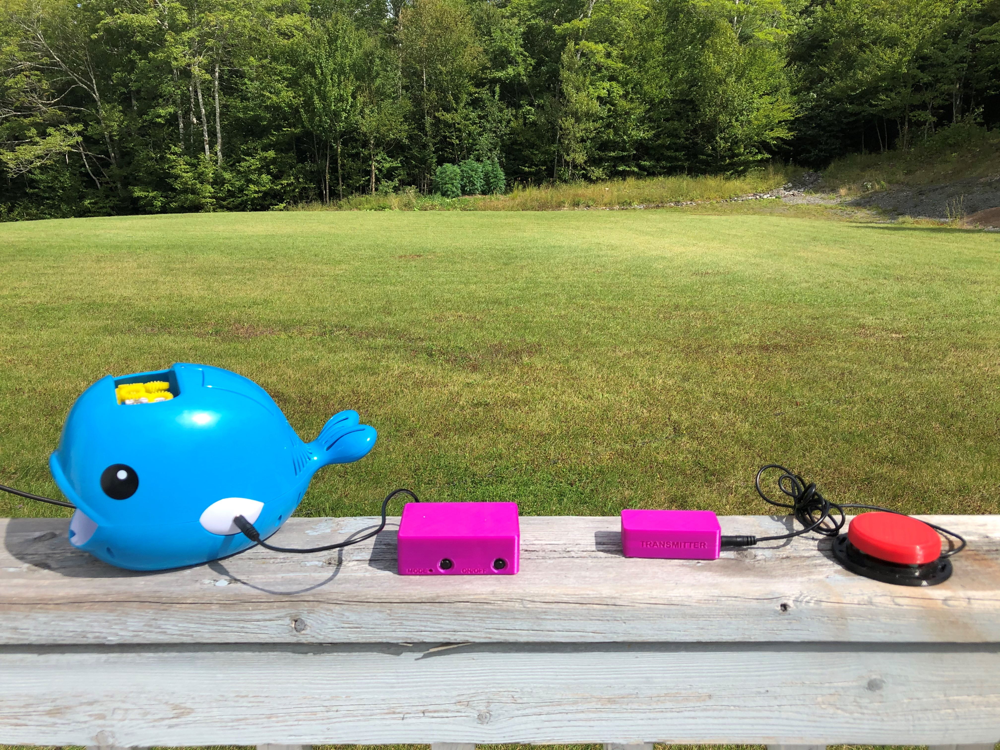

# Wireless Assistive Switch Link
The Wireless Assistive Switch Link is a device that enables a wireless connection between an assistive switch and an output device that has a 3.5 mm jack. In addition to momentary control, the device also has the option of pre-set timed latches of 10 seconds, 1 minute, or 5 minutes. This device may be useful for someone who would benefit from a wireless connection between the switch and the output device or using the latching feature for output devices. 

## Usage
An assistive switch is connected to the 3.5 mm jack on the transmitter. The 3.5 mm plug on the receiver is then connected to the input of the device to be controlled. With the receiver powered on, the receiver will activate the output device when the assistive switch is activated. 
The device can operate in several modes:

•	Momentary Switch: The output device will turn off about 0.5 seconds after the user stops pressing the switch.

•	Toggle Switch: Activating the assistive switch will activate the output device. The output device will remain on until the assistive switch is released, and pressed again. 

•	10 Second Latched Timer: After the assistive switch is pressed and released, the output device will remain on for 10 seconds and then turn off.

•	1 Minute Latched Timer: After the assistive switch is pressed and released, the output device will remain on for 1 minute and then turn off.

•	5 Minute Latched Timer: After the assistive switch is pressed and released, the output device will remain on for 5 minutes and then turn off. 

The mode can be changed by pressing the Mode Button on the Receiver. See the User Guide for instructions.

## More info at
- [Makers Making Change Project Page](https://makersmakingchange.com/project/wireless-assistive-switch-link/)

## How to Obtain a Wireless Assistive Switch Link

### 1. Do it Yourself (DIY) or Do it Together (DIT)

This is an open-source assistive technology, so anyone is free to build it. All of the files and instructions required to build the device are contained within this repository. Refer to the Maker Checklist below.

### 2. Request a build of this device

If you would like to obtain this device, you may submit a build request through the [MMC Library Page](https://makersmakingchange.com/project/wireless-assistive-switch-link/). The requestor is responsible for the cost of materials and any shipping.

### 3. How to build this device for someone else

If you have the skills and equipment to build this device, and would like to donate your time to create the switch for someone who needs it, visit the [MMC Maker Wanted](https://makersmakingchange.com/maker-wanted/) section.

## Getting Started

### 1. Read the Makers Checklist

The Makers Checklist provides an overview of the steps required to build this device.

### 2. Order the Off-The-Shelf Components

The [Bill of Materials](/Documentation/Wireless_Assistive_Switch_Link_BOM_v1.0.xlsx) lists all of the parts and components required to build the Open Wobble Switch. The main switch component needs to be ordered online. The rest of the off-the-shelf components are also online or may be available in smaller quantities at your local hardware store or dollar store.

### 3. Print the 3D Printable components

All of the files and individual print files can be in the [/Build_Files/3D_Printing_Files](/Build_Files/3D_Printing/) folder.

### 4. Assemble the Device

Reference the [Assembly Guide](/Documentation/Wireless_Assistive_Switch_Link_Assembly_Guide_v1.0.pdf) for the tools and steps required to build each portion.

## Files
### Documentation
| Document             | Version | Link |
|----------------------|---------|------|
| Design Rationale     | 1.0     | [Wireless Assistive Switch Link_Design_Rationale](/Documentation/Wireless_Assistive_Switch_Link_Design_Rationale_v1.0.pdf)     |
| Maker Checklist      | 1.0     | [Wireless Assistive Switch Link_Maker_Checklist](/Documentation/Wireless_Assistive_Switch_Link_Maker_Checklist_v1.0.pdf)     |
| Bill of Materials    | 1.0     | [Wireless Assistive Switch Link_Bill_of_Materials](/Documentation/Wireless_Assistive_Switch_Link_BOM_v1.0.xlsx)     |
| 3D Printing Guide    | 1.0     | [Wireless Assistive Switch Link_3D_Printing_Guide](/Documentation/Wireless_Assistive_Switch_Link_3D_Printing_Guide_v1.0.pdf)     |
| Assembly Guide       | 1.0     | [Wireless Assistive Switch Link_Assembly_Guide](/Documentation/Wireless_Assistive_Switch_Link_Assembly_Guide_v1.0.pdf)     |
| User Guide           | 1.0     | [Wireless Assistive Switch Link_User_Guide](/Documentation/Wireless_Assistive_Switch_Link_User_Guide_v1.0.pdf)    |
| Changelog            | 1.0     | [Wireless Assistive Switch Link_Changelog](/Documentation/Wireless_Assistive_Switch_Link_Changelog_v1.0.pdf)     |

### Design Files
 - [CAD Files](/Design_Files)

### Build Files
 - [3D Printing Files](/Build_Files/3D_Printing_Files)

## Attribution
Designers:
 - Kerilyn Kennedy, Makers Making Change

## License
Everything needed or used to design, make, test, or prepare the Wireless Assistive Switch Link is licensed under the CERN 2.0 Permissive license <https://ohwr.org/project/cernohl/wikis/Documents/CERN-OHL-version-2> (CERN-OHL-P) . 

Accompanying material such as instruction manuals, videos, and other copyrightable works that are useful but not necessary to design, make, test, or prepare the Wireless Assistive Switch Link are published under a Creative Commons Attribution-ShareAlike 4.0 license https://creativecommons.org/licenses/by-sa/4.0/ (CC BY-SA 4.0).

----

## About Us

Makers Making Change is an initiative of [Neil Squire](https://www.neilsquire.ca/), a Canadian non-profit that helps people with disabilities.

We are committed to creating a network of volunteer makers who support people with disabilities in their communities through 3D printing assistive devices. Check out our library of free, open-source assistive technologies with parts and build instructions.

 - Website: [www.MakersMakingChange.com](https://www.makersmakingchange.com/)
 - GitHub: [https://github.com/makersmakingchange](https://github.com/makersmakingchange)
 - Twitter: [@makermakechange](https://twitter.com/makermakechange)
 - Instagram: [@makersmakingchange](https://www.instagram.com/makersmakingchange)

## Contact Us

For technical questions, to get involved, or share your experience we encourage you to visit the [MMC Website](https://www.makersmakingchange.com/), [MMC Forum](https://makersmakingchange.com/forum), or contact info@makersmakingchange.com
